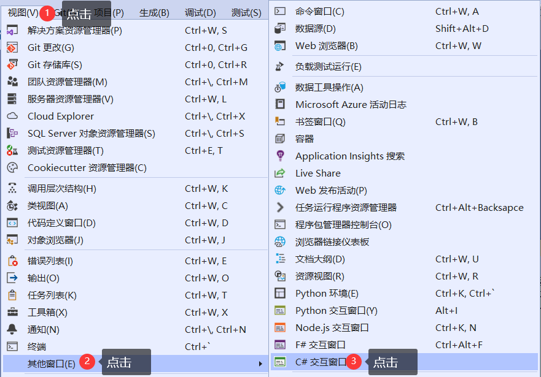
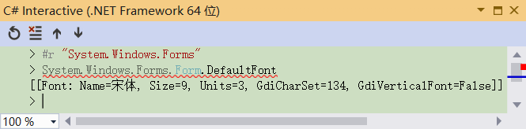

# C# Interactive
## 1、概述
+ C# Interactive是Visual Studio中的一个REPL工具，用于交互式地运行C#代码，能直接执行语句和计算表达式。  

## 2、用途
+ 执行C#代码，快速得到结果。
+ 可以一边开发一边测试表达式。
+ 学习C#时，实践语法点和功能。
## 3、打开
+ 点击Visual Studio的“视图”主菜单
+ 点击“其它窗口”菜单项
+ 点击“C#交互窗口”菜单项  

+ 点击底部的“C# Interactive”选项条  

## 4、界面

+ 按钮 将执行上下文重置为初始状态，保留历史记录。同#reset命令。
+ 按钮 清除编辑器窗口中的内容，保留历史记录和执行上下文不变。同#cls或#clear命令。
+ 按钮 将当前提交替换为前一个提交。同按下Alt键和向上方向键。
+ 按钮 将当前提交替换为后一个提交(在之前已向后导航之后)。同按下Alt键和向下方向键。
## 5、操作
+ 执行表达式
    + 在>后录入表达式，按回车键，将在下行显示计算值  
    
    + 执行语句时，输入半角分号后按下回车。则执行语句  
    
## 6、快捷键
+ 回车
    + Enter 
        + 如果显示当前提交完成，则对其进行求值。
        + 否则，插入新行。
    + Ctrl和Enter 
        + 在当前提交内，对当前提交求值。
        + 在前一个提交内，将前一个提交追加到当前提交。
    + Shift和Enter 插入新行。
    + 先Ctrl和K再Ctrl和Enter 在交互式缓冲区末尾粘贴选定内容，将插入点置于输入末尾。
    + 先Ctrl和E再Ctrl和Enter 粘贴选定内容，并在交互式缓冲中任何挂起的输入之前执行。
+ 箭头
    + Alt和↑ 将当前提交替换为前一个提交。
    + Alt和↓ 将当前提交替换为后一个提交(在之前已向后导航之后)。
    + Ctrl和Alt和↑ 将当前提交替换为以相同文本开头的前一个提交。
    + Ctrl和Alt和↓ 将当前提交替换为以相同文本开头的后一个提交(在之前已向后导航之后)。
+ 其它
    + Ctrl和A 
        + 第一次按下时，选择包含光标的提交
        + 第二次按下时，选择窗口中的所有文本。
    + Escape 清除当前提交。
## 7、添加引用
+ #r命令可以添加对指定程序集及其所有依赖项的元数据引用  
    
+ 添加当前项目及依赖的程序集
    + 项目中的代码  
        
    + 在解决方案中右键单击项目  
     
    + 点击“对交互窗口进行项目初始化”菜单项  
     
## 8、加载代码
+ 将代码文件保存在后缀名为.csx的文件中  

+ 使用#load命令加载指定的脚本文件并执行  

+ 可用于测试表达式和语句结果时，导入公共代码。
## 9、帮助
+ #help命令显示帮助  

